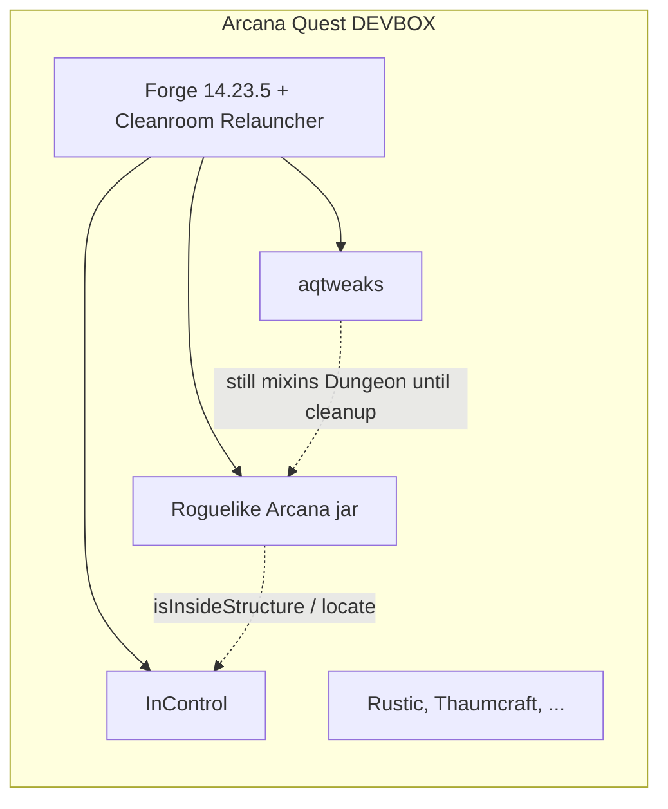
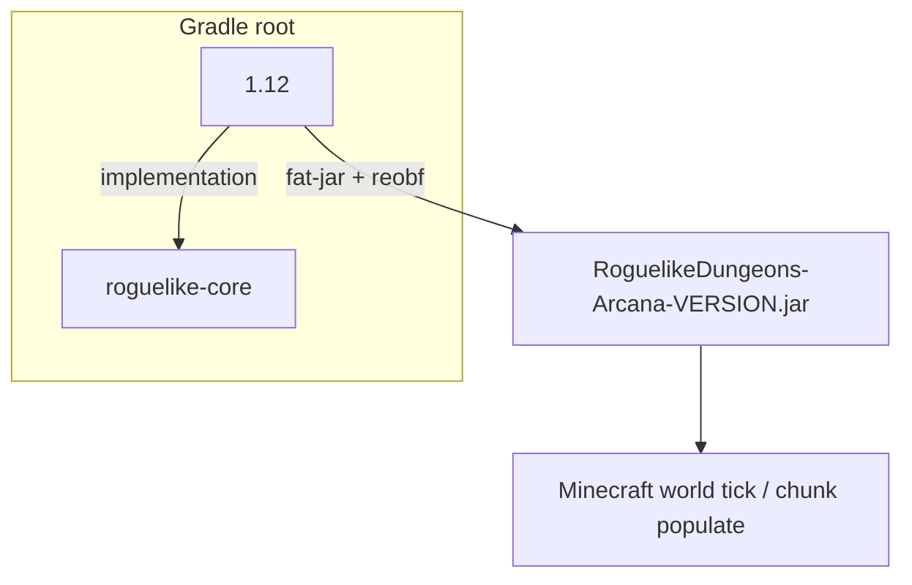
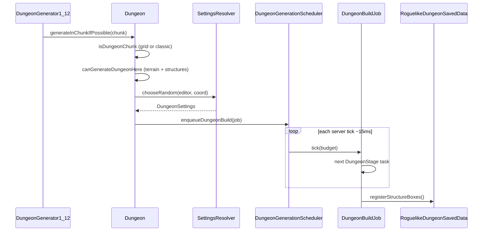
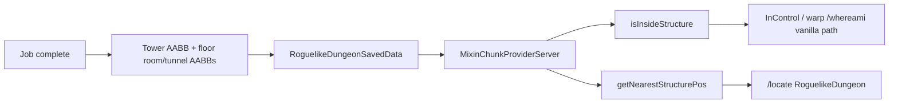

# Architecture — Roguelike Dungeons Arcana

Full-scale architecture for **Roguelike Dungeons — Arcana Edition**, a Forge **1.12.2** fork of Greymerk’s dungeon generator, maintained for the Arcana Quest pack.

This document is the system map. Operational details (mixin crashes, Tweaks cleanup, Devbox cfg values) live in the sibling docs listed in [README.md](README.md).

---

## 1. Purpose and context

The mod places **seeded, themed dungeon complexes** in the overworld: a surface tower, stacked underground levels, rooms, corridors, loot, and spawners. Arcana-specific work keeps generation **tick-friendly**, maps finished dungeons into vanilla **structure queries**, and exposes theme/spawn knobs the pack actually uses.

**Not in scope for this fork:** other Minecraft versions, a Cleanroom/Unimined rewrite, or lowering `/roguelike` below permission 4.

Runtime world: stock Forge loader plus relauncher (game JVM may be Java 25). **This jar is Java 8 bytecode.**

---

## 2. Containers (modules)

| Container | Responsibility | Forbidden |
|-----------|----------------|-----------|
| **roguelike-core** | Settings, spawn math, layout, rooms, themes, loot rules, `WorldEditor` API | `net.minecraft`, Forge |
| **1.12** | Forge mod class, mappers, mixins, commands, `WorldEditor1_12`, scheduler | Dungeon algorithm (keep in core) |

`1.12/build.gradle` jars core classes into the playable artifact. Tests run against core only (`roguelike-core/src/test`).

**Decision:** keep the split. Merging core into `1.12` would make unit tests need Minecraft and would mix generation bugs with mapping bugs.

---

## 3. Package map

Two namespaces, one generator (authorship history, not two engines):

| Namespace | Typical contents |
|-----------|------------------|
| `greymerk.roguelike.*` | `Dungeon`, rooms under `prototype`, themes, layout, tasks, treasure, config |
| `com.github.fnar.*` | Block/item models, loot parsers, commands, generatables (stairs, foundations, thresholds), extra rooms, 1.12 mappers |

`RoomSetting` instantiates rooms from **both**. Tweaks mixins pin **`greymerk.roguelike.dungeon.Dungeon`** by FQCN (`remap = false`). A wholesale package rename without Tweaks is a pack break.

`src/main` vs `src/test` is standard Gradle, not a second product.

---

## 4. Runtime flow — spawn to finished dungeon

### 4.1 Worldgen hook

`Roguelike.preInit` registers `DungeonGenerator1_12` as `IWorldGenerator`. On populate it wraps the world in `WorldEditor1_12` and calls `Dungeon.generateInChunkIfPossible`. Failures are swallowed by `SafeRunnable` so a bad dungeon does not crash chunk gen.

Manual `/roguelike dungeon` uses the same job path (queued, not instant).

### 4.2 Chunk eligibility (`Dungeon.isDungeonChunk`)

1. `doNaturalSpawn`
2. Dimension whitelist/blacklist (`SpawnCriteria`)
3. **Grid** (default): `isGridSpawnHit` — one target chunk per cell of size `gridMaxChunkDistance`, offset from `gridMinChunkDistance` + `gridSeedOffset` + world seed  
4. **Classic** (`enableClassicRoguelikeGeneration=true`): frequency/chance scatter

Do not overlay Tweaks’ `isDungeonChunk` mixin; it replaces this method.

### 4.3 Site validity (`canGenerateDungeonHere`)

Air at `upperLimit`, solid ground, free overhead, then **vanilla structure distance**:

- `VILLAGE` → `spawnMinimumDistanceFromVillages` (code default 75)
- Other listed types → `spawnMinimumDistanceFromVanillaStructures` (code 50, Devbox **200**)

List: `vanillaStructuresToCheckMinimumDistanceFrom`. Distance `<= 0` skips that type.

### 4.4 Settings selection (`SettingsResolver`)

JSON under `config/roguelike_dungeons/` plus builtin Java settings. Inheritance is recursive (`inherit` IDs). Custom exclusive valid settings win over builtin if `doBuiltinSpawn` allows builtins. Weighted random among valid.

### 4.5 Job execution (`DungeonBuildJob`)

Stages in `DungeonStage` order. Registry (`DungeonTaskRegistry`) binds one task each:

| Stage | Task | Role |
|-------|------|------|
| LAYOUT | `DungeonTaskLayout` | Per-level graph (classic or MST) |
| ENCASE | `DungeonTaskEncase` | Optional shell |
| TUNNELS | `DungeonTaskTunnels` | Corridors |
| SEGMENTS | `DungeonTaskSegments` | Wall decorations |
| ROOMS | `DungeonTaskRooms` | Room geometry |
| LINKS | `DungeonTaskLinks` | Level connectors (`LinkerRoom`, etc.) |
| TOWER | `DungeonTaskTower` | Surface entrance |
| FILTERS | `DungeonTaskFilters` | Post-pass filters |
| LOOT | `DungeonTaskLoot` | Chests |
| AFTER | `DungeonTaskSupports` | Foundations / pillars (`FoundationSupport`) |

`DungeonGenerationScheduler` drains a per-world queue on `TickEvent.WorldTickEvent` END with **15 ms** budget. One task may still overrun. Unfinished jobs **drop on world unload**.

**Critical:** tick-sliced completion does **not** return from a single `Dungeon.generate()`. Hooks on `generate()` RETURN (Tweaks box registration) never fire. Boxes are registered in `complete()`.

### 4.6 Vertical structure

- `NUM_LAYERS = 10`, `VERTICAL_SPACING = 10`
- Level 0 near `TOPLEVEL` (50); each level steps down
- Stairwell grates: `LinkerRoom` using **primary** theme bars
- Supports: probe to **Y −64** (not vanilla 5); floor search **below** `levelY` only; lanterns `rustic:iron_lantern`

Layout types: `LayoutGenerator.Type.CLASSIC` or `MST`.

---

## 5. World editor (anti-corruption layer)

Core never touches `World`. All mutation goes through `WorldEditor`.

`WorldEditor1_12` maps brushes to 1.12 `IBlockState`, implements:

- `setBlock` / bulk `chunk.setBlockState` for air and opaque cubes
- Chests, spawners, loot tables, biome queries
- `enqueueDungeonBuild` → scheduler (client/unavailable world: run to completion)
- `registerDungeonStructure` → `RoguelikeDungeonSavedData`
- `findNearestStructure` → vanilla `ChunkProviderServer.getNearestStructurePos`

Brushes (`BlockBrush`, `SingleBlockBrush`, weighted/jumble/layers/…) are core types; 1.12 mappers live under `com.github.fnar.minecraft.**`.

---

## 6. Themes and rooms

A `Theme` is two `BlockSet`s: **primary** (structure) and **secondary** (accent). JSON fields per set: `floor`, `walls`, `stair`, `pillar`, `door`, `lightblock`, `liquid`, `bars`.

Omitted `bars` → iron bars. `primary.bars` = linker stairwells only; `secondary.bars` = other bar uses (prison, sewers, smithy, …). See [themes.md](themes.md).

Rooms are `RoomType` → `RoomSetting` → `BaseRoom` subclass. Flags: intersection vs secret. Extra Fnar rooms (`NetherPortalRoom`, `PlatformsRoom`, …) register beside Greymerk `prototype` rooms.

---

## 7. Structure integration (vanilla API)

Finished dungeons persist AABBs in world storage key **`roguelike_dungeon_boxes`**.

| Query | Source of truth |
|-------|-----------------|
| “Am I inside a dungeon?” | AABBs of a **completed** job |
| “Where is the nearest dungeon?” | Grid cell: placed tower, queued job, or **queue** at first legal `canGenerateDungeonHere` site |

`isInsideStructure("RoguelikeDungeon")` is **not** the whole grid cell.

Mixins: [mixins.md](mixins.md). Do not mixin `World`; locate goes through `ChunkProviderServer` (SRG, `remap = false`, priority 1100).

---

## 8. Commands

| Surface | Perm | Implementation |
|---------|------|----------------|
| `/roguelike` | **4** (entire tree) | `RoguelikeCommand1_12` routes: biome, citadel, config, dungeon, locate, give, room(s), settings, tower |
| `/whereami` | **0** | `CommandWhereAmI`; Roguelike boxes **direct**; other structures via provider; re-registered on `FMLServerStartedEvent` |
| `/locate RoguelikeDungeon` | **2** | Vanilla command + mixins |

Do not lower `/roguelike locate` to 2. Vanilla `/locate` is the public locate.

---

## 9. Configuration and data

| Store | Key / path | Owner |
|-------|------------|--------|
| `config/roguelike_dungeons/roguelike.cfg` | spawn, grid, distances | `RogueConfig` |
| `config/roguelike_dungeons/*.json` | dungeon settings | `SettingsContainer` |
| World `MapStorage` | `roguelike_dungeon_boxes` | `RoguelikeDungeonSavedData` |

Existing cfg **string lists are not merged** when Java defaults change. Devbox values often differ from code defaults ([config.md](config.md)).

---

## 10. Cross-cutting

**Performance:** tick budget; bulk block set; mapper cache. `ROOMS` / `FILTERS` / `AFTER` can still hitch.

**Safety:** generation exceptions log and mark the job failed; populate is wrapped in `SafeRunnable`.

**Pack coupling:** Rustic lanterns, Y −64, Tweaks mixins, InControl structure name `RoguelikeDungeon`. Tweaks still owns cave mixins and (until cleanup) dungeon mixins — [tweaks-handoff.md](tweaks-handoff.md).

**Build:** JDK 8, ForgeGradle 6, jar `RoguelikeDungeons-Arcana-<version>.jar`, `:1.12:build` deploys to Devbox — [build-and-deploy.md](build-and-deploy.md).

---

## 11. Architecture decisions (record)

| ID | Decision | Why |
|----|----------|-----|
| A1 | Core without Minecraft | Test generation; keep 1.12 as mapping |
| A2 | Grid spawn default, not classic | Predictable spacing for the pack |
| A3 | Tick-sliced jobs | Avoid multi-second populate stalls |
| A4 | Register structure boxes on job complete | `generate()` RETURN never runs on the async path |
| A5 | Separate village vs other structure distances | Villages have little underground loot; temples/mineshafts do |
| A6 | Mixins: SRG + `remap = false`, no `World` mixin | No refmap; `World` already loaded in DEFAULT phase |
| A7 | Stay Java 8 / ForgeGradle | Pack is hybrid Forge+relauncher; Tweaks Unimined does not buy dungeon features |
| A8 | `/roguelike` stays perm 4 | Destructive commands share the parent; locate for players is vanilla `/locate` |
| A9 | Do not collapse greymerk/fnar packages until Tweaks dungeon mixins are gone | FQCN mixins and reflection |

---

## 12. Where to change what

| If you are changing… | Start here |
|----------------------|------------|
| Spawn chance / grid / distances | `RogueConfig`, `Dungeon.isDungeonChunk` / `hasStructureTooCloseBy` |
| Room geometry | `dungeon.rooms.prototype` or `com.github.fnar.roguelike.dungeon.rooms`, then `RoomSetting` |
| Theme blocks | `BlockSet` / JSON; bars split in [themes.md](themes.md) |
| Stage order / extra pass | `DungeonStage`, `DungeonTaskRegistry` |
| Block placement / perf | `WorldEditor1_12` |
| `/locate` or InControl | mixins + `RoguelikeDungeonSavedData` |
| Commands | `greymerk.roguelike.command.routes` + `RoguelikeCommand1_12` |

Known failures and the fixes: [issues-and-fixes.md](issues-and-fixes.md).
